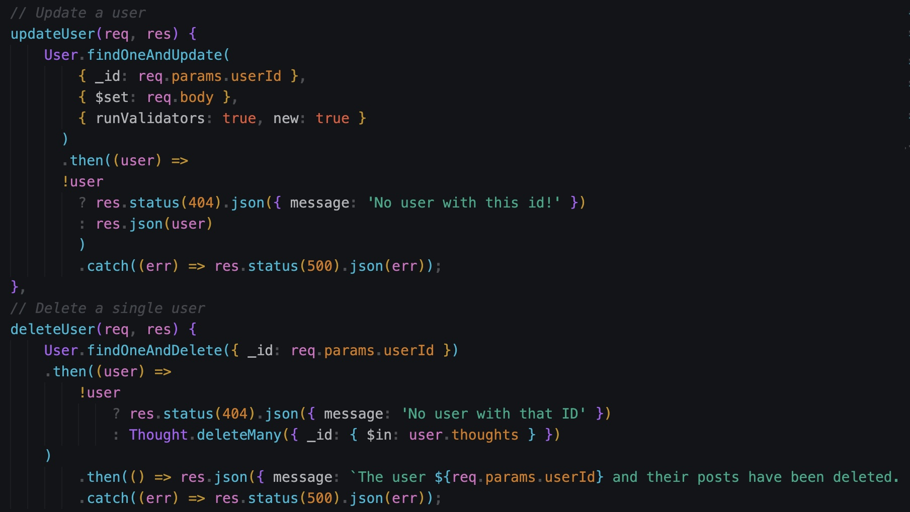

# BuzzBytes Social Media

## Description

For this project, I was tasked to build the back end routes for a fictional social media platform using Express, MongoDB, and Insomnia. I decided to name mine "BuzzBytes". This application is able to create users, add friends, post thoughts, and reply to those thoughts with reactions (and much, much more). I struggled with seeding the database with randomized users, friends, thoughts, and reactions. However, I realized that we don't need to actually "seed" the database with anything because we can create our data in real time in Insomnia once the application has started. Other than that, I think this project went smoothly for me.

## Table of Contents
  - [Installation](#installation)
  - [Usage](#usage)
  - [License](#license)
  - [Questions](#questions)
 

## Installation

1. Clone the project repository to your local machine.

## Usage

1. Open Insomnia and create a local connection to a new DB collection.

1. In your I.D.E terminal, navigate to the project directory and run `npm install` to install the required dependencies.

2. Run `npm run seed`.

3. Run `npm start`.

(There's a chance you have to actually create the database first before you can run the seed and start the application. I'm not sure. Didn't sleep well last night.)

## License

This project has been released under the MIT license. 

---

## Questions

  - Github: [@tolivercrisp](https://github.com/tolivercrisp)
  - Email: [toliverjcrisp@gmail.com](mailto:toliverjcrisp@gmail.com)